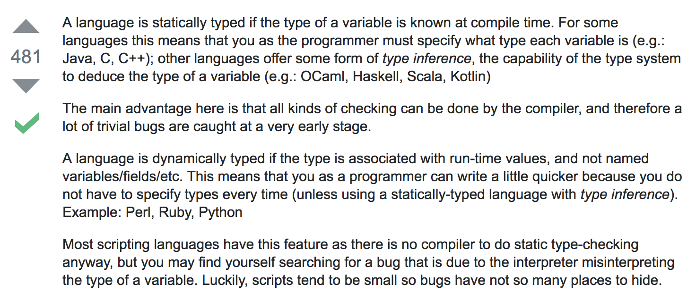

# SBCS React + Typescript Workshop

## Prequesites

* A computer
* Web Browser
* Text editor
* npm

## Part 1: Intro

### What is React

"React is a declarative, efficient, and flexible JavaScript library for building user interfaces."

### WTF does that mean

It means it make your life easier when desining a good UI.

And it does this using a thing called a Component. A component takes in parameters, called props, and one of its functions, that is `render()` returns a description of what needs to be rendered. The components can also have a state, which is private to the component. React then uses that description, mushes it together with the props and state and puts it on the screen. So at any given time, the appearance of any component is a function of its props and state. 


### Why React?

* Simple and Powerful
* Makes organizing code easy
* One way dataflow reduces complexity
* Componentization makes it easy to test

### What is TypeScript?

TypeScript is a typed superset of JavaScript that compiles to plain JavaScript.

### Static vs Dynamic Typing

;

### Advantages of Typescript

* *Optional* static typing
* Type Inference, which gives some of the benefits of types, without actually using them
* Access to ES6 and ES7 features, before they become supported by major browsers
* The ability to compile down to a version of JavaScript that runs on all browsers
* Great tooling support with IntelliSense

## Part 2: Lets make stuff

### Setting up a project

In a new directory run:

```
npm init
npm install --save webpack typescript
npm install --save react react-dom @types/react @types/react-dom
```

Create a new filed called webpack.config.js and type the following

```js
var webpack = require('webpack');
var path = require('path');

var BUILD_DIR = path.resolve(__dirname, 'build');
var APP_DIR = path.resolve(__dirname, 'src');

var config = {
  entry: APP_DIR + '/index.jsx',
  output: {
    path: BUILD_DIR,
    filename: 'bundle.js'
  },
  resolve: {
    extensions: ['.js', '.jsx']
  }
};

module.exports = config;
```

Now run

```
npm install --save-dev babel-core babel-loader babel-preset-es2015 babel-preset-es2016 babel-preset-es2017 babel-preset-react
```

Create a new file called .babelrc

```
{
	"presets" : ["es2017", "react"]
}
```

And modify the webpack config to include:


```js
var config = {
	...,
	module : {
		loaders : [
			{
				test : /\.jsx?/,
				include : APP_DIR,
				loader : 'babel-loader'
			}
		]
	}
}
```


## Part 3: Typescript

Run the following commands:

```
npm install --save ts-loader @types/react @types/react-dom
```

Create a tsconfig.json

```json
{
    "compilerOptions": {
        "outDir": "./dist/",
        "target": "es5",
        "moduleResolution": "node",
        "sourceMap": true,
        "jsx": "react",
        "alwaysStrict": true,
        "noImplicitAny": true,
        "strictNullChecks": true
    },
    "exclude": [
        "./node_modules"
    ],
    "include": [
        "./src/**/*"
    ]
}
```

Update the webpack.config.js

```js
var path = require('path');
const webpack = require("webpack");

var config = {
  entry: './src/index',
  output: {
    filename: "bundle.js",
    path: __dirname + "/build"
  },
  resolve: {
    // Add '.ts' and '.tsx' as resolvable extensions.
    extensions: [".ts", ".tsx", ".js", ".json"]
  },
  devtool: "source-map",
  module: {
    rules: [
      {
        test: /\.tsx?$/,
        use: 'ts-loader',
        exclude: /node_modules/
      }
    ]
  },
};

module.exports = config;
```